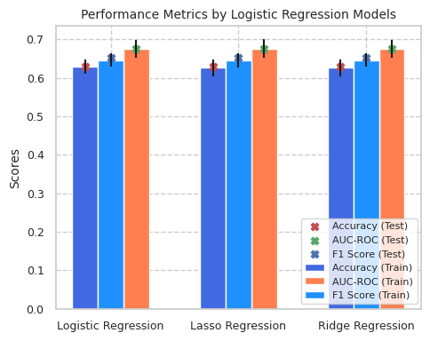
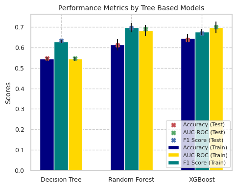
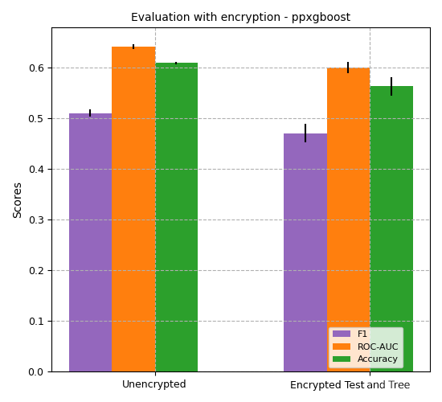
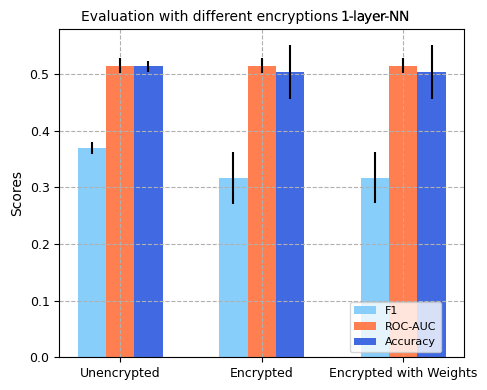
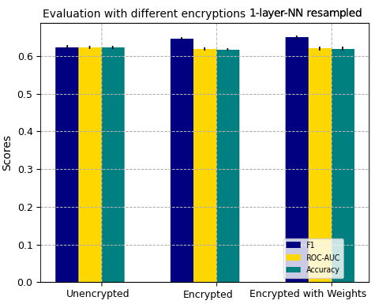
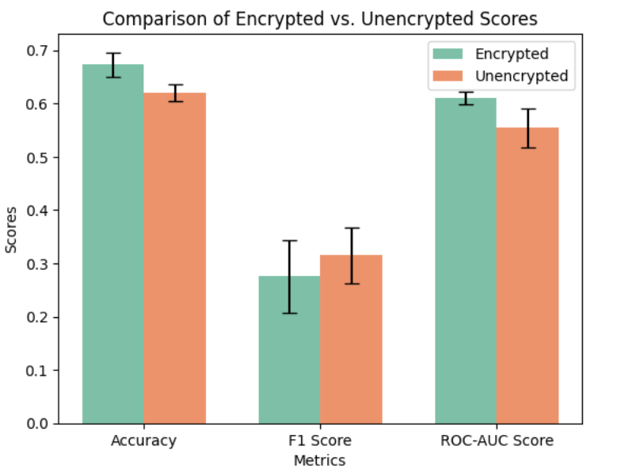

# Privacy-Preserving Machine Learning on Clinical & Genomics Data

In this project, we conduct several experiments to assess the feasibility of using homomorphic encryption (HE) on the MSK-IMPACT dataset [[1](https://www.scopus.com/inward/record.uri?eid=2-s2.0-85020279899&doi=10.1038%2fnm.4333&partnerID=40&md5=7373fa2a55cf9270c031d09e2abc8a83)] to train and evaluate machine learning (ML) models. The novelty of the project stems from the fact that the dataset contains both clinical and genomic features and discusses the potential to use HE in this use case. After preprocessing, our dataset has a total of 18 features (13 clinical, 5 genomic) with the aim of classifying *overall survival status.* 

## Code Outline and Instructions for Reproducing our Results

The `data/` folder contains the original MSK-IMPACT data as msk_impact_2017_clinical_data.tsv and our preprocessed data as train_encoded.csv, test_encoded.csv, and combined_encoded.csv. 

`preprocessing and base models.ipynb` contains the notebook with exploratory data analysis, our preprocessing strategy, base model training and evaluation. Run this code to reproduce our results on non-encrypted data for non-encrypted models (section 3.2, Non-encrypted ML Models in the report, Fig. 2 and Fig 3).

`XGB encrypted evaluation.ipynb` contains the notebook for the encrypted evaluation of an XGBoost model using ppxgboost [[2](https://github.com/awslabs/privacy-preserving-xgboost-inference)]. Run this code to reproduce our results on unencrypted and encrypted data (section 3.3, 3.3.1 XGBoost encrypted evaluation, Fig 4).

`LR encrypted evaluation.ipynb` contains the notebook for the encrypted evaluation of a 1-layer-NN using TenSEAL [[3](https://github.com/OpenMined/TenSEAL)]. `LR encrypted evaluation resampled.ipynb` contains results for the same model trained on resampled data to combat class imbalance. Run these two notebooks to reproduce our results on unencrypted and encrypted data (section 3.3, 3.3.2 1-layer-NN encrypted evaluation, Fig 5, 6).

`LR encrypted training.ipynb` contains the notebook for the encrypted training of a 1-layer-NN using TenSEAL. Run this code to reproduce our results for section 3.4 Encrypted training, Fig 7. **Note that running this notebook requires a high RAM environment**.

## Results: Base ML Models
Before performing encryption of any kind, we first train various ML models on the MSK-IMPACT data to establish baseline performance. The process is to establish baseline performance for ML models trained on this dataset. The results below illustrate performance of non-encrypted models on non-encrypted data.

### Logistic Regression

### Tree-based Methods

## Results: Encrypted Evaluation
This section compares results of models trained on non-encrypted data but evaluated with encrypted data and/ or encrypted weights.

### XGBoost

### 1-layer-NN

## Results: Encrypted Training on 1-layer-NN

# References

1. Zehir A, Benayed R, Shah RH, Syed A, Middha S, Kim HR, Srinivasan P, Gao J, Chakravarty D, Devlin SM, Hellmann MD. Mutational landscape of metastatic cancer revealed from prospective clinical sequencing of 10,000 patients. Nature medicine. 2017 Jun;23(6):703-13.
1.  Meng X, Feigenbaum J. Privacy-preserving xgboost inference. arXiv preprint arXiv:2011.04789. 2020 Nov 9. https://github.com/awslabs/privacy-preserving-xgboost-inference
2. Benaissa A, Retiat B, Cebere B, Belfedhal A.E., "TenSEAL: A Library for Encrypted Tensor Operations Using Homomorphic Encryption", ICLR 2021 Workshop on Distributed and Private Machine Learning (DPML 2021). https://github.com/OpenMined/TenSEAL 
3. Chen H, Gilad-Bachrach R, Han K, Huang Z, Jalali A, Laine K, Lauter K. Logistic regression over encrypted data from fully homomorphic encryption. BMC medical genomics. 2018 Oct;11:3-12.